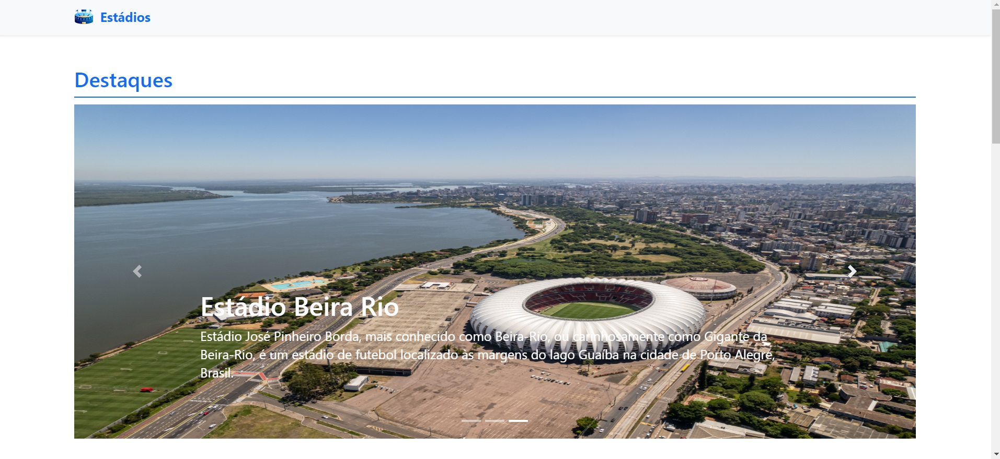

# stadium-albuns




> Trabalho prático desenvolvido para a disciplina Desenvolvimento de Interfaces Web.

## 💻 Pré-requisitos

Antes de começar, verifique se você atendeu aos seguintes requisitos:

- Você instalou a versão mais recente do `<node>`
- Você tem uma máquina `<Windows / Linux / Mac>`.

## 🚀 Instalando <stadium-albuns>

Para instalar o <stadium-albuns>, siga estas etapas:

Windows, Linux, macOS:

```
<npm install>
```

## ☕ Usando <stadium-albuns>

Para usar <stadium-albuns>, siga estas etapas:

```
<live-server>
<json-server --watch data.json --port 3000>
<Acesse o seu live server>
```

## 📫 Contribuindo para <stadium-albuns>

Para contribuir com <stadium-albuns>, siga estas etapas:

1. Bifurque este repositório.
2. Crie um branch: `git checkout -b <nome_branch>`.
3. Faça suas alterações e confirme-as: `git commit -m '<mensagem_commit>'`
4. Envie para o branch original: `git push origin <stadium-albuns> / <local>`
5. Crie a solicitação de pull.

Como alternativa, consulte a documentação do GitHub em [como criar uma solicitação pull](https://help.github.com/en/github/collaborating-with-issues-and-pull-requests/creating-a-pull-request).
